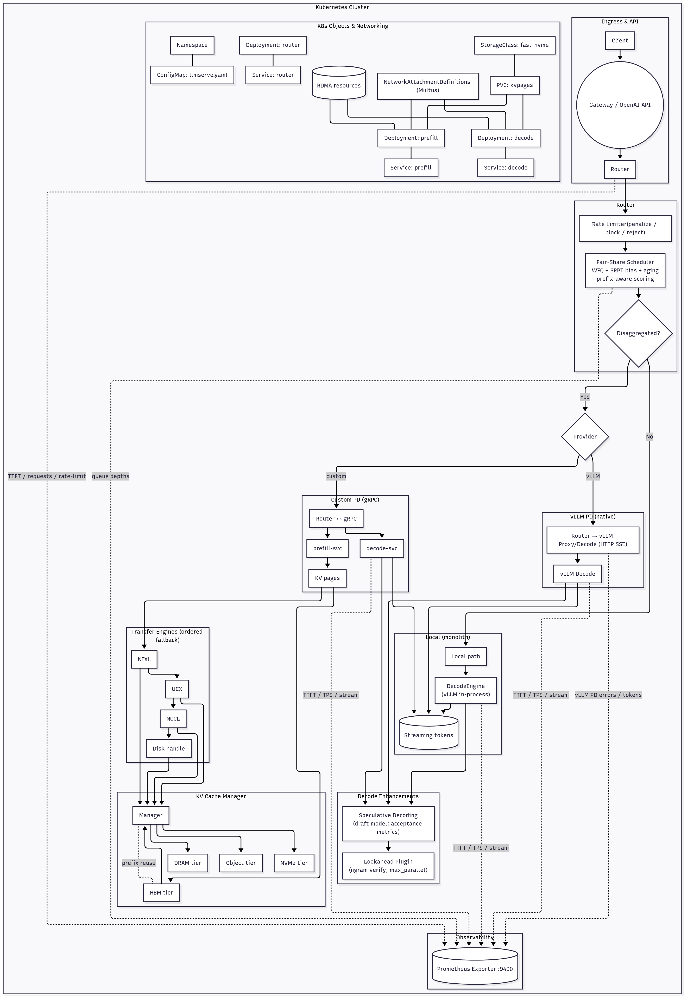

# LLMServe

Production-ready LLM serving with vLLM, disaggregated prefill/decode, continuous batching, tiered KV-cache (GPU → DRAM → NVMe → Object), NIXL/UCX/NCCL transfer engines, speculative decoding, and a fair-share scheduler.
Single command brings the whole stack up from a YAML manifest.


## Features
-	Disaggregated prefill (compute-heavy) and decode (memory-bandwidth-bound)
-	Continuous batching (via vLLM) for high throughput
-	KV-cache paging & tiering with optional quantization (HBM fp16/bf16/fp8, disk int8/zstd)
-	Transfer engine selection: NIXL → UCX → NCCL (automatic fallback)
-	Speculative decoding with a draft model
-	Fair-share scheduler (WFQ + SRPT bias + aging) with budgets: tokens-in-flight, HBM GB, IO Gbps, per-tenant concurrency
-	Manifest-driven configuration (hot-reload planned)
-	One command local runner; Kubernetes apply path included
-	Prometheus metrics (+ tracing hooks)


## Quick start

- Requirements
	-	Linux with NVIDIA GPU (A100/H100/L40S class recommended), CUDA 12.x runtime
	-	Python 3.10+
	-	Optional (for NIXL): NVIDIA Dynamo/NIXL runtime on nodes
	-	For Kubernetes path: kubectl, a cluster with GPU nodes and an NVMe StorageClass

- Install

	```sh
 		python -m pip install -U pip
  		pip install -e .
	```
- Configure

	-	Edit llmserve.yaml (the manifest). The default is production-lean; tune models, budgets, storage classes, and transfer engines as needed.

- Run (one command)

	- 	Local/dev (all roles in one process):

		```sh
  		llmserve up -f llmserve.yaml
  		```
		API on :8000, metrics on :9400
		
	-	Kubernetes (render & apply minimal manifests):
		
		```sh
  		llmserve up -f llmserve.yaml --mode k8s
  		```
		
		For full K8s control, use the files under deploy/k8s/ and mount your manifest via ConfigMap.


## How it works (high-level)


>	-	Prefill produces KV pages; transfer engine moves pages to the chosen decode worker and/or tiered storage.
>	-	Router is KV-locality-aware and enforces budgets via the scheduler.
>	-	Decode streams tokens with optional speculative decoding.


## Manifest (YAML)

Everything is configured in one file. Example: [llmserve-dev.yaml](examples/local/llmserve-dev.yaml)]
```sh
apiVersion: v1
kind: LLMServe
metadata: {name: prod}
spec:
  models:
    primary:
      id: mistralai/Mistral-7B-Instruct
      dtype: bf16
      max_model_len: 32768
      tensor_parallel: 2
      pipeline_parallel: 1
    draft:
      id: TinyLlama/TinyLlama-1.1B-Chat-v1.0
      enabled: true
      speculative_tokens: 8
      ...
```


## CLI

```sh
llmserve up -f llmserve.yaml              # local (one process, all roles)
llmserve up -f llmserve.yaml --mode k8s   # render+apply minimal K8s
llmserve apply -f llmserve.yaml           # validate manifest, print plan
llmserve status                           # quick cluster status (stub)
llmserve bench --mix long:30 short:70     # local synthetic generator (stub)
```
## How to run in k8s:
- Generate gRPC stubs (once per change of .proto)
```
llmserve gen-proto
```
- Build and push image
```
docker build -t ghcr.io/yourorg/llmserve:0.1.0 .
docker push ghcr.io/yourorg/llmserve:0.1.0
```
- Set disaggregated in your manifest:
```
# spec:
#   deployment:
#     mode: k8s
#     disaggregated: true
#     replicas: { router: 1, prefill: 2, decode: 4 }
```
- Render + apply
```
llmserve up -f llmserve.yaml --mode k8s --namespace llmserve --image ghcr.io/yourorg/llmserve:0.1.0 --apply
```

## Repository structure

```
llmserve/
├── pyproject.toml
├── llmserve.yaml
├── deploy/
│   ├── Dockerfile
│   └── k8s/
│       ├── router-deploy.yaml
│       ├── prefill-deploy.yaml
│       ├── decode-deploy.yaml
│       ├── kv-manager-statefulset.yaml
│       ├── service-router.yaml
│       └── storageclass-fast-nvme.yaml
└── src/llmserve/
    ├── cli.py            # one-command orchestrator (local/k8s)
    ├── runner.py         # orchestrator class (pools, router, engines)
    ├── config.py         # manifest loader & models
    ├── apiserver/http.py # FastAPI (OpenAI-like endpoints)
    ├── router/           # placement, KV locality, policy
    ├── scheduler/        # fair-share + budgets
    ├── engines/          # vLLM prefill/decode wrappers
    ├── kvstore/          # manager, tiers, quantization
    ├── transfer/         # NIXL/UCX/NCCL engines (NIXL preferred)
    └── metrics/          # Prometheus metrics server
```

### Optimizations enabled by default
-	Chunked prefill: reduces head-of-line blocking, improves fairness
-	Continuous batching: vLLM default
-	KV prefix caching: reuse common system/user prefixes
-	Speculative decoding: when spec.draft.enabled=true
-	KV tiering & quantization: controlled via kv_cache.* and storageClasses
-	Transfer engine selection: transfer.engine_order guides NIXL→UCX→NCCL
-	Budgets & fairness: budgets.* and scheduling.*

### Deployment (Kubernetes)
-	Label nodes by role:
-	role=prefill for compute-heavy GPUs
-	role=decode for NVMe-equipped, bandwidth-heavy GPUs
-	Provide a fast NVMe StorageClass for the KV manager StatefulSet
-	Optional: install NIXL/Dynamo runtime on nodes for RDMA/GDS paths
-	Mount your llmserve.yaml as ConfigMap to all pods

## Metrics

_Default Prometheus exporter on :9400._
-	Latency: TTFT histogram
-	Throughput: decode TPS histogram
-	Queues: prefill/decode depths
-	Resource: tokens-in-flight, HBM GB, IO Gbps (coming with fuller accounting)
-	Transfer: engine chosen, transfer latency/GBps (roadmap)


### Tuning guide (quick)
-	TTFT too high: increase tensor_parallel, raise min_decode_slots, enable draft model, reduce prefill_long_prompt_tokens.
-	TPS too low: increase max_decode_concurrency, enable speculative decoding, raise max_tokens_in_flight.
-	HBM pressure: lower max_decode_concurrency, increase page_size_kb, switch hbm_dtype to fp8 (if stable on your stack), dial up eviction.
-	IO saturation: lower max_kv_io_gbps, prefer NVMe over remote object for hot prefixes, enlarge pages to reduce overhead.
-	KV thrash: raise hot_keep_secs, increase tenant_hotset_gb for noisy tenants, enable prefetch_on_prefix on fast NVMe.


## Security
-	API keys or OIDC (API keys in spec.security.api_keys)
-	Optional TLS/mTLS between services (ingress responsibility)
-	On-disk KV pages can be encrypted at rest (filesystem/S3 options in tiers—roadmap)

## Roadmap
-	Wire vLLM paged-attention KV page APIs end-to-end
-	UCX/NCCL engines full implementation
-	Hot-reload manifest (/reload)
-	Advanced placement (KV locality scoring)
-	Sequence/context parallel (experimental flag)
-	Full dashboards & tracing
-	Rust control plane (router + scheduler), Python engines via FFI


## Troubleshooting
-	“NIXL not available”: library/runtime missing; the runner will fall back to UCX/NCCL. Ensure drivers and Dynamo/NIXL are installed if you want RDMA/GDS paths.
-	OOM in decode: lower max_tokens_in_flight, increase eviction aggressiveness, reduce max_decode_concurrency.
-	High p95 TTFT: increase min_decode_slots; keep chunked_prefill=true; scale prefill replicas; consider tensor_parallel=2+.
